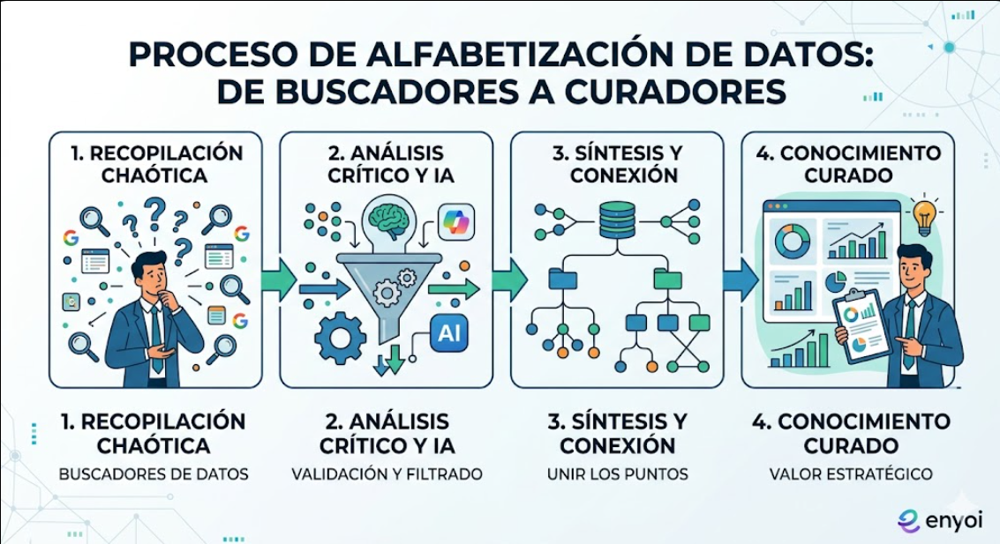
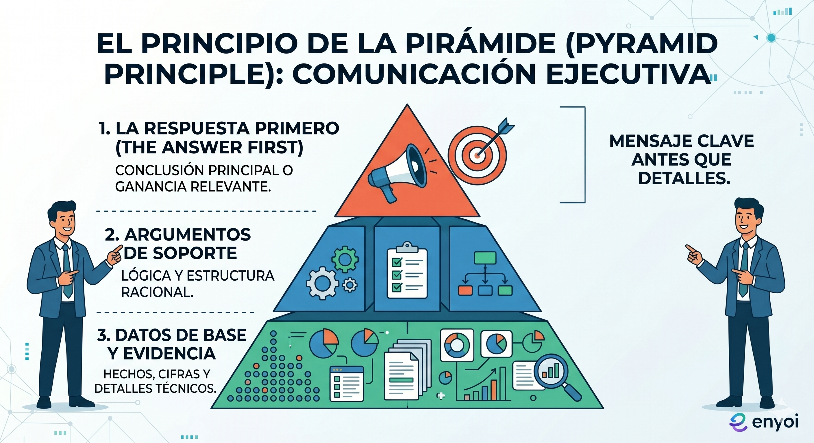

# Sesión 7: El Ecosistema de Ejecución {background-color="#2c3e50"}

## Agenda de hoy (180 min / 3 Horas)

::: {style="font-size: 0.7em;"}
1.  **Seguimiento HU2 (15 min):** Calibración final de Prompts Maestros.
2.  **Teoría: IA y Alfabetización de Datos (25 min):** Por qué buscar no es investigar.
3.  **Edge Copilot: Inteligencia de Mercado (35 min):** Benchmark y validación normativa.
4.  **Teoría: Storytelling de Alto Impacto (25 min):** El Principio de la Pirámide.
5.  **Diseño de Diapositivas con IA (30 min):** Narrativa del Pitch Ejecutivo.
6.  **☕ Break (15 min)**
7.  **Sinergia y ROI (35 min):** Cuantificación económica del ahorro.
:::

---

# Seguimiento de Proyecto: Clínica HU2 🏥 {background-color="#b03a2e"}

## ¿Tu Prompt Maestro es "Inmune a Errores"?

::: {style="font-size: 0.7em;"}
Antes de avanzar, validemos la estructura de tu solución técnica.

::: {.fragment .fade-in}
* **ACTR Check:** ¿El rol es lo suficientemente específico? (ej. "Auditor de Riesgo" vs "Analista").
* **Paradoja de la IA:** Si el prompt es genérico, el resultado es mediocre. ¿Tu prompt tiene "contexto de negocio"?
* **Output:** ¿El formato de salida facilita el siguiente paso de tu proceso?
:::

::: {.callout-important}
### El Objetivo
Tu prompt debe reducir un proceso de 90 minutos a menos de 5, manteniendo la calidad bancaria.
:::
:::

---

# Teoría I: Alfabetización de Datos 📊 {background-color="#2c3e50"}

## De "Buscadores" a "Curadores"

::: {style="font-size: 0.65em;"}
En la era de la IA, el valor no está en encontrar información, sino en **validarla y conectarla**.

::: {.fragment .fade-in}
1.  **Información Estática vs. Dinámica:** Google te da links; Copilot en Edge te da **síntesis**.
2.  **El Sesgo de IA:** Aprenderemos a pedir a la IA que busque "puntos de vista contrarios" para evitar sesgos de confirmación.
3.  **La Triangulación:** Un dato es válido solo si la IA lo encuentra en una fuente oficial y nosotros lo validamos.
:::

{fig-align="center" width="400"}

::: {.fragment .fade-up}
> "La IA no reemplaza tu juicio, potencia tu capacidad de análisis crítico."
:::
:::

---

# Edge Copilot: Radar de Inteligencia 🔍 {background-color="#2c3e50"}

## Benchmark y Validación en Tiempo Real

::: {style="font-size: 0.7em;"}
Usaremos el panel lateral de Edge para fundamentar tu "Problem Statement".

::: {.fragment .fade-in}
* **Análisis Documental:** Sube la normativa interna o un reporte al navegador.
* **Prompt de Mercado:** *"Actúa como un experto en banca panameña. Compara los tiempos de este proceso con los estándares internacionales de eficiencia"*.
* **Extracción de Insights:** Convierte un PDF de 60 páginas en 3 "Bullet Points" de impacto.
:::

::: {.callout-tip}
### Ejercicio
Encuentra una cifra de ahorro o tendencia de IA en banca que respalde por qué tu proyecto es urgente hoy.
:::
:::

---

# Teoría II: Storytelling Ejecutivo 🗣️ {background-color="#2c3e50"}

## El Principio de la Pirámide

::: {style="font-size: 0.65em;"}
Para convencer a una dirección, la estructura debe ser inversa a la académica.

::: {.fragment .fade-in}
1.  **La Respuesta Primero:** Empieza con el beneficio (ej. "Ahorro de $50k anuales").
2.  **Argumentos de Soporte:** Los 3 pilares que sostienen ese beneficio.
3.  **Datos de Base:** Los detalles técnicos y evidencias.
:::

{fig-align="center" width="350"}

::: {.fragment .fade-in}
**Fórmula de Impacto:**
`Ganancia Relevante + Problema Resuelto + Evidencia = Aprobación.`
:::
:::

---

# De los Datos a las Slides: El Flujo 🎨 {background-color="#2c3e50"}

## Arquitectura de la Narrativa

::: {style="font-size: 0.7em;"}
No copies y pegues; **traduce** los hallazgos de Edge a un guion de presentación.

::: {.fragment .fade-in}
1.  **El Gancho:** Usa el dato de mercado que encontraste en Edge.
2.  **El Proceso:** Muestra el flujo "Antes" (Caos/Tiempo) vs "Después" (IA/Eficiencia).
3.  **La Demostración:** El Prompt Maestro en acción.
:::

 

::: {.fragment .fade-up}
**Tip de Copilot en PPT:**
Usa el comando `/crear presentación a partir del archivo` en el Word donde estructuraste tu guion.
:::
:::

---

# 🛠️ Lab: Diseño de tu Pitch

::: {style="font-size: 0.6em;"}
**Prompt Maestro de Storytelling:**
> "Actúa como un experto en presentaciones ejecutivas. He recolectado estos datos en Edge: [Insertar datos]. Mi proyecto consiste en: [Nombre]. Diseña el guion para 5 diapositivas siguiendo el Principio de la Pirámide. Cada slide debe tener: Título de alto impacto, Mensaje principal y sugerencia de visual."

 

::: {.callout-note}
### Nota de Diseño
Enfócate en la claridad. La IA se encarga del diseño; tú te encargas de la estrategia.
:::
:::

---

# ☕ Break (15 min) {background-color="#000000"}

---

# Sinergia Inter-áreas 🏢 {background-color="#2c3e50"}

## El Valor Sistémico del Ahorro

::: {style="font-size: 0.75em;"}
Tu proyecto impacta toda la cadena de valor del banco. No es una isla.

::: {.fragment .fade-in}
* **Colaboración:** Crea un componente o página con tu plan y compártelo en Teams con áreas como Legal o Riesgos para que vean cómo tu optimización les ayuda a ellos.
* **Pregunta de Sinergia:** *"Si yo libero 10 horas a la semana, ¿cómo acelero el trabajo del área que recibe mis resultados?"*
:::

::: {.fragment .fade-in}
**Efecto Dominó:** La agilidad en una célula (tu área) genera una respuesta más rápida para el cliente final de Bancolombia.
:::
:::

---

# 🛠️ Taller: Cuantificación del ROI 📊 {background-color="#b03a2e"}

## Hablando el lenguaje de tus líderes

::: {style="font-size: 0.7em;"}
Para que tu jefe diga "SÍ", necesitas datos, no solo opiniones:

::: {.fragment .fade-in}
1.  **Liberación de Capacidad:** ¿Qué tareas de "estrategia" podrías hacer si dejas de hacer este proceso manual?
2.  **Mitigación de Riesgo Operativo:** ¿Cuánto le cuesta al banco un error humano en este proceso? La IA no se cansa ni se distrae.
:::

 

**Prompt de Negocio:**
> "Actúa como un Analista Financiero. Basado en mi solución de IA que reduce el tiempo de [X] de 90 a 5 minutos, redacta un párrafo ejecutivo que justifique la implementación de este proceso enfocándose en el ahorro de costos operativos y la mejora en la calidad del dato."
:::

---

# Dinámica Final: Pitch de Optimización ⏱️ {background-color="#2c3e50"}

## Convence a tu superior en 60 segundos

::: {style="font-size: 0.75em;"}
Olvida las ventas; esto es **eficiencia organizacional**. Usa esta estructura:

1.  **El Problema Operativo:** "Actualmente, nuestro equipo dedica X horas a [Tarea], lo cual frena el avance de [Objetivo del área]."
2.  **La Optimización con IA:** "He validado un ecosistema usando Copilot y Edge que reduce este tiempo a Y minutos con un 99% de precisión."
3.  **El Impacto en el Banco:** "Esto nos permite escalar el proceso y reducir el riesgo de errores en un Z%."
4.  **La Petición (The Ask):** "Solicito su visto bueno para iniciar un piloto de una semana con mi equipo cercano."

 

::: {.fragment .fade-up}
**Feedback entre pares:** ¿Es claro el beneficio para el banco o suena a 'juego con IA'?
:::
:::

---

## ¡Listos para la Recta Final! {.center .text-center background-color="#2c3e50"}

::: {.center}
### Fabio Zapata
**Enseñanza de IA & Productividad**
:::un 90%."
:::
