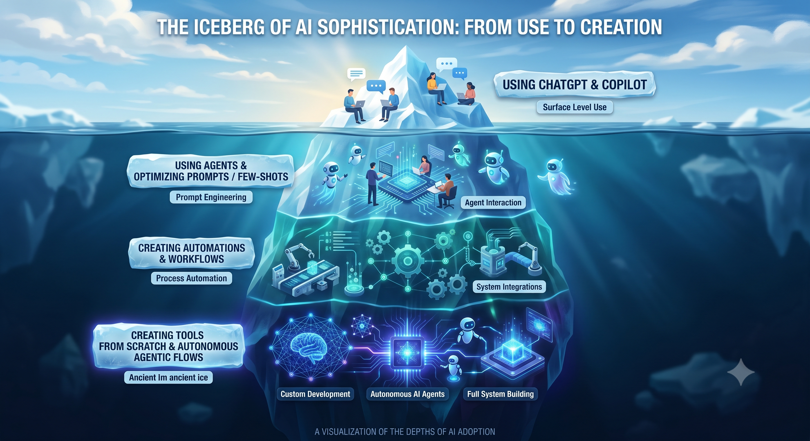

## Sesión 9: El Pitch Final {background-color="#2c3e50"}

### Agenda de hoy (180 min / 3 Horas)

::: {style="font-size: 0.75em;"}
1. **Calentamiento y Ajustes (30 min):** Último repaso a las diapositivas.
2. **Bloque de Pitches I (60 min):** Presentaciones de las primeras áreas.
3. **Bloque de Pitches II (50 min):** Presentaciones de las áreas restantes *(¡Tiempo optimizado!)*.
4. **Inspiración Colectiva & Resumen (30 min):** Lecciones aprendidas, el Iceberg de la IA y el futuro.
5. **Cierre y Celebración (10 min):** Próximos pasos con la IA.
:::

---

## Recap: El Camino Recorrido 🚀 {background-color="#2c3e50"}

::: {style="font-size: 0.5em;"}
¿Qué logramos al llegar hasta aquí?
:::

::: {.fragment .fade-in}
- **Módulo 1 & 2:** Dominamos la ingeniería de prompts y la mente detrás de la IA.
:::
::: {.fragment .fade-in}
- **Módulo 3:** Aplicamos la IA en Riesgos, Finanzas, Marketing y RRHH.
:::
::: {.fragment .fade-in}
- **Módulo 4:** Integramos Teams, Loop y Planner en un flujo colaborativo.
:::
::: {.fragment .fade-in}
- **Módulo 5 (Sesión 8):** Rediseñamos procesos y calculamos el impacto real.
:::
::: {.fragment .fade-in}
- **Hoy:** Compartimos tu "Mapa de Ahorro" con el equipo.
:::

---

## Reglas del Juego: El Pitch de 3 Minutos ⏱️ {background-color="#b03a2e"}

::: {style="font-size: 0.75em;"}
Para que todos puedan brillar, mantendremos este ritmo:
:::

::: {.fragment .fade-in}
- **3 Minutos de Exposición:** El problema, tu solución y tu ROI.
:::
::: {.fragment .fade-in}
- **1 Minuto de Feedback:** Una pregunta o comentario de tus compañeros.
:::
::: {.fragment .fade-in}
- **Foco en el Impacto:** Queremos ver cuánto tiempo recuperaste para tareas de valor.
:::

---

## Bloque de Pitches I {background-color="#2c3e50"}

::: {style="font-size: 0.8em;"}
Áreas invitadas al escenario:

- Riesgos y Cumplimiento.
- Finanzas y Contabilidad.
- Cartera y Operaciones.
:::

::: {.callout-note}
### Tip para el público
Anoten una idea de cada presentación que podrían aplicar en su propia área mañana.
:::

---

## Bloque de Pitches II {background-color="#2c3e50"}

::: {style="font-size: 0.8em;"}
Áreas invitadas al escenario:

- Comercial y Mercadeo.
- Talento Humano y Cultura.
- Jurídica y Estrategia.
:::

::: {.callout-tip}
### El Poder del Ejemplo
Recuerden: No es magia, es metodología aplicada al negocio.
:::

---

## Inspiración Colectiva 💡 {background-color="#2c3e50"}

::: {style="font-size: 0.75em;"}
Mesa Redonda: ¿Qué nos llevamos?
:::

::: {.fragment .fade-in}
- ¿Cuál fue la herramienta o truco que más cambió tu perspectiva?
:::
::: {.fragment .fade-in}
- ¿Qué tarea que antes te frustraba hoy te genera satisfacción resolver con IA?
:::
::: {.fragment .fade-in}
- ¿Cuál es el siguiente proceso que planeas rediseñar?
:::

---

## El Iceberg de la IA: Esto recién comienza 🧊 {background-color="#2c3e50"}

::: {style="font-size: 0.75em;"}
Lo que aprendimos en este curso es solo la **punta del iceberg** (prompts, flujos de trabajo, automatización básica).
:::

{fig-align="center" width="80%"}

---

## El Futuro: Más allá de este curso 🚀 {background-color="#2c3e50"}

::: {style="font-size: 0.7em;"}
La IA evoluciona cada semana. Tu rol ahora es:
:::

::: {.fragment .fade-in}
- **Evangelizar:** Comparte tus prompts ganadores con tu equipo.
:::
::: {.fragment .fade-in}
- **Iterar:** No te conformes con el primer resultado; sigue puliendo tus Agentes.
:::
::: {.fragment .fade-in}
- **Ser Crítico:** Mantén siempre el criterio humano sobre el resultado de la máquina.
:::
---

## ¡Felicidades, Pioneros de la IA! {background-color="#2c3e50"}

::: {style="text-align: center; font-size: 0.75em; line-height: 1.6; margin: 1.2em auto 0 auto; max-width: 900px; padding: 25px; background: rgba(255, 255, 255, 0.05); border-radius: 12px; border-left: 6px solid #00f2fe; box-shadow: 0 4px 15px rgba(0,0,0,0.2); font-style: italic;"}
"La mejor forma de predecir el futuro es creándolo con los mejores prompts. El aprendizaje no termina aquí; la IA no va a reemplazar a los profesionales, pero los profesionales que usan IA tendrán una gran ventaja a los que no lo hacen. ¡Sigan construyendo, sigan optimizando!"
:::

::: {style="text-align: center; margin-top: 1.5em;"}
### Fabio Zapata
:::

